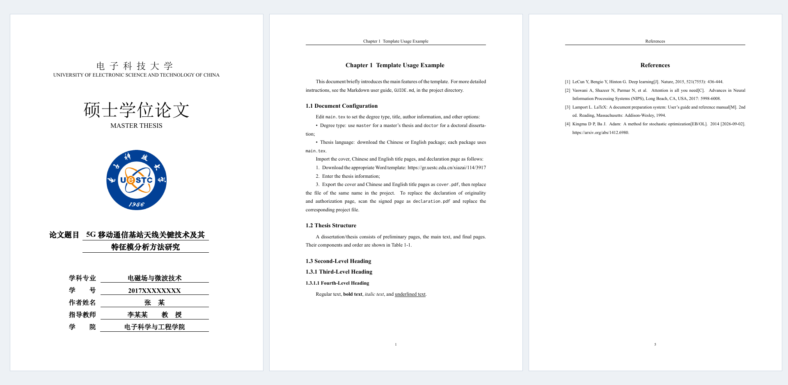

<h1 align="center">UESTC Thesis</h1>

LaTeX thesis template for the University of Electronic Science and Technology of China

  
  
  
  

<a href="https://github.com/Xovee/uestc-thesis/blob/main/README.md">中文</a> · <strong>English</strong>

- **Easy**: simple to use and quick to get started.
- **Accurate**: follows UESTC requirements and closely matches the official template.
- **Fast**: efficient compilation, validated on multiple real theses and dissertations.
- **Maintained**: ongoing updates informed by school requirements and user feedback.

## Download

**Current version: 1.0.1.** Download the template for your thesis language, or read the [release notes](https://github.com/Xovee/uestc-thesis/releases/tag/v1.0.1).

| English thesis | 中文论文 |
| :---: | :---: |
| [uestc-thesis-xovee-english.zip](https://github.com/Xovee/uestc-thesis/releases/download/v1.0.1/uestc-thesis-xovee-english.zip) | [uestc-thesis-xovee-chinese.zip](https://github.com/Xovee/uestc-thesis/releases/download/v1.0.1/uestc-thesis-xovee-chinese.zip) |
| [Sample PDF](docs/previews/english.pdf) · [User guide](GUIDE-english.md) | [查看示例 PDF](docs/previews/chinese.pdf) · [阅读指南](GUIDE.md) |

Each package has one `main.tex` entry file with the language and example chapters configured. Both include Chinese and English abstracts.

## Write locally

1. **Install the tools**: TeX Live 2026 (MacTeX 2026 on macOS), VS Code and the LaTeX Workshop extension.
2. **Open the template**: extract your language package, open the entire folder in VS Code, and edit `main.tex` and `chapters/`.
3. **Build and preview**: compile `main.tex` with LaTeX Workshop to generate `output/main.pdf`. Subsequent edits build automatically when saved.

See the [user guide](GUIDE-english.md) for installation, first-build instructions and cover setup.

Verified on **Windows · macOS · Overleaf**, using TeX Live / MacTeX 2026 and XeLaTeX.

> Check your final thesis against the [current UESTC requirements](https://gr.uestc.edu.cn/xiazai/114/3917).

## Write on Overleaf

Edit and compile in [Overleaf](https://www.overleaf.com/) without installing software:

1. Choose **New Project → Upload Project** and upload the Chinese or English template ZIP. No extraction is needed.
2. In project settings, select **XeLaTeX**, **TeX Live 2026**, and `main.tex` as the main document.
3. Click **Recompile** and check the example before editing your thesis.

Import directly: [English template](https://www.overleaf.com/docs?snip_uri=https%3A%2F%2Fgithub.com%2FXovee%2Fuestc-thesis%2Freleases%2Fdownload%2Fv1.0.1%2Fuestc-thesis-xovee-english.zip) · [中文模板](https://www.overleaf.com/docs?snip_uri=https%3A%2F%2Fgithub.com%2FXovee%2Fuestc-thesis%2Freleases%2Fdownload%2Fv1.0.1%2Fuestc-thesis-xovee-chinese.zip). Check the compiler settings above after importing.

See the [user guide](GUIDE-english.md) for full instructions. Long theses may exceed the compile timeout on the free plan.

## Feedback and contributions

Questions and improvements are welcome through [Issues](https://github.com/Xovee/uestc-thesis/issues) and pull requests. For build problems, please include your operating system, TeX Live version, error messages and a small reproducible example where possible. You can also ask an AI assistant for initial troubleshooting help.

## License

Copyright © 2025–2026 [Xovee Xu](https://www.xoveexu.com/).

Template code is licensed under [LPPL 1.3c](LICENSE); see [NOTICE.md](NOTICE.md) for third-party rights.

## Acknowledgements

Thanks to [Wenxin Tai](https://wxtai.github.io/) and [Abdisalam](https://scholar.google.com/citations?user=1eUyqGQAAAAJ&hl=en&oi=ao) for providing their doctoral dissertations for testing this template.

## Contact

[Xovee Xu](https://www.xoveexu.com/)

- `xovee.xu at gmail.com`
- `xovee at uestc.edu.cn`
