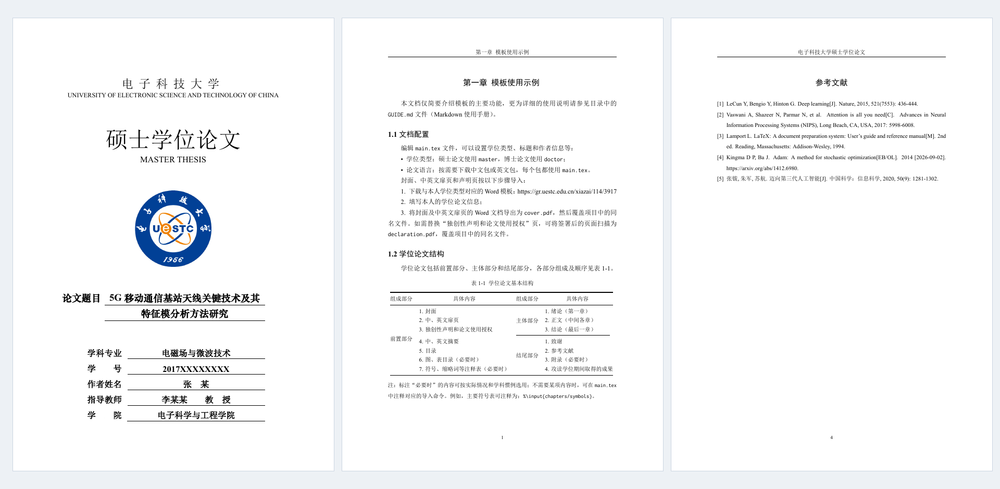

<h1 align="center">UESTC Thesis</h1>

电子科技大学研究生学位论文 LaTeX 模板

  
  
  
  

<strong>中文</strong> · <a href="https://github.com/Xovee/uestc-thesis/blob/main/README-english.md">English</a>

- **易**：使用简单，入门快捷。
- **准**：遵循学校规范，贴合官方模板。
- **快**：编译高效，在多篇真实学位论文上经过验证。
- **新**：持续维护，跟进规范与用户反馈。

## 下载模板

**当前版本：1.0.0。** 按论文语言下载模板，或查看[发布说明](https://github.com/Xovee/uestc-thesis/releases/tag/v1.0.0)。

| 中文论文 | English thesis |
| :---: | :---: |
| [uestc-thesis-xovee-chinese.zip](https://github.com/Xovee/uestc-thesis/releases/download/v1.0.0/uestc-thesis-xovee-chinese.zip) | [uestc-thesis-xovee-english.zip](https://github.com/Xovee/uestc-thesis/releases/download/v1.0.0/uestc-thesis-xovee-english.zip) |
| [查看示例 PDF](docs/previews/chinese.pdf) · [阅读指南](GUIDE.md) | [Sample PDF](docs/previews/english.pdf) · [User guide](GUIDE-english.md) |

每个包只有一个 `main.tex` 入口，正文示例和语言已配好，同时保留中英文摘要。

## 本地写作

1. **安装环境**：TeX Live 2026（macOS 使用 MacTeX 2026）、VS Code 和 LaTeX Workshop 扩展。
2. **打开模板**：解压语言包，用 VS Code 打开整个文件夹，在 `main.tex` 和 `chapters/` 中填写与写作。
3. **编译预览**：使用 LaTeX Workshop 编译 `main.tex`，生成 `output/main.pdf`；之后保存修改即可自动编译。

安装、首次编译和封面设置的详细步骤见[使用指南](GUIDE.md)。

已验证：**Windows · macOS · Overleaf**，均使用 TeX Live / MacTeX 2026 和 XeLaTeX。

> 提交前请按[学校最新要求](https://gr.uestc.edu.cn/xiazai/114/3917)检查论文。

## Overleaf 在线写作

无需安装软件，在 [Overleaf](https://www.overleaf.com/) 中编辑和编译论文：

1. 选择 **New Project → Upload Project**，上传中文或英文模板 ZIP，无需解压。
2. 在项目设置中选择 **XeLaTeX**、**TeX Live 2026**，主文件为 `main.tex`。
3. 点击 **Recompile**，确认示例生成后开始修改论文。

也可一键导入：[中文模板](https://www.overleaf.com/docs?snip_uri=https%3A%2F%2Fgithub.com%2FXovee%2Fuestc-thesis%2Freleases%2Fdownload%2Fv1.0.0%2Fuestc-thesis-xovee-chinese.zip) · [English template](https://www.overleaf.com/docs?snip_uri=https%3A%2F%2Fgithub.com%2FXovee%2Fuestc-thesis%2Freleases%2Fdownload%2Fv1.0.0%2Fuestc-thesis-xovee-english.zip)。导入后仍需确认上述编译设置。

完整操作见[使用指南](GUIDE.md)。长篇论文可能超过免费计划的编译时限。

## 反馈与贡献

遇到问题或有改进建议，欢迎提交 [Issue](https://github.com/Xovee/uestc-thesis/issues) 或 Pull Request。报告编译问题时，最好附上系统、TeX Live 版本、错误信息和可复现的小例子。当然，有问题的时候可以先问一下大模型。

## 许可

Copyright © 2025–2026 [Xovee Xu](https://www.xoveexu.com/)。

模板代码采用 [LPPL 1.3c](LICENSE)，第三方材料的权利说明见 [NOTICE.md](NOTICE.md)。

## 致谢

感谢[台文鑫](https://wxtai.github.io/)和 [Abdisalam](https://scholar.google.com/citations?user=1eUyqGQAAAAJ&hl=en&oi=ao) 提供博士学位论文用于本模板的测试。

## 联系方式

[Xovee Xu](https://www.xoveexu.com/)

- `xovee.xu at gmail.com`
- `xovee at uestc.edu.cn`
